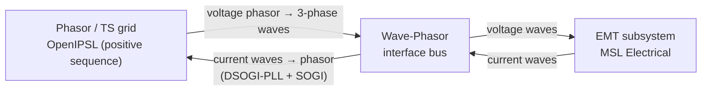

# OpenIWPI

**A Modelica library that couples phasor-based (TS) and electromagnetic-transient (EMT) power-system models, so converter-rich grids can be simulated — and linearized — as a single hybrid EMT–TS model.**

[](./LICENSE) [](https://doi.org/10.5281/zenodo.20586745)

*Repository archived on Zenodo — DOI: [10.5281/zenodo.20586745](https://doi.org/10.5281/zenodo.20586745)*

This repository is the open-source companion to the paper *"OpenIWPI: Open-Instance Wave-Phasor Interface Library for Power System Simulation Studies in Modelica"* by M. de Castro and L. Vanfretti, presented at the **16th International Modelica & FMI Conference** (Lucerne, Switzerland, September 8–10, 2025). OpenIWPI is a Modelica library that interconnects electromagnetic-transient (EMT) models with the phasor-based power-system components of [OpenIPSL](https://github.com/OpenIPSL/OpenIPSL), so that hybrid EMT–TS systems can be simulated — and linearized — together in a single Modelica model, without co-simulation.

---

## Overview

Modern grids host a growing number of power-electronic, converter-based resources. Some parts of a study need a detailed **electromagnetic-transient (EMT)** representation (fast switching dynamics), while the bulk grid is best modeled with **phasor / positive-sequence transient-stability (TS)** models. Traditionally these two worlds live in separate tools and are stitched together with *ad-hoc* co-simulation, which is cumbersome and breaks small-signal analysis.

OpenIWPI takes a different route: a **wave-phasor interface** — built from a positive-sequence filtering approach (DSOGI-PLL and SOGI filters) — lets a single Modelica model contain both an EMT subsystem (modeled with the Modelica Standard Library's Electrical package) and a phasor grid (modeled with OpenIPSL). The whole hybrid model is solved with a single variable-step solver (e.g. DASSL), and — uniquely among EMT-capable tools — it can be **linearized** for small-signal stability analysis (e.g. with `Modelica_LinearSystems2`) and exported as an FMU when co-simulation is genuinely needed.

In short: model the plant you care about in EMT detail, keep the rest of the network as a phasor equivalent, and study them together.

## How the interface works



The phasor side acts as a variable voltage source on the interface bus (phasor-to-wave); the EMT side acts as a variable current injection, whose positive-sequence phasor is recovered by filtering the three-phase current waves (wave-to-phasor).

## Repository structure

| Path | Contents |
| --- | --- |
| [`OpenIWPI/`](./OpenIWPI) | The OpenIWPI Modelica library (load `OpenIWPI/package.mo`). |
| [`LICENSE`](./LICENSE) | 3-Clause BSD license. |

The library (`OpenIWPI/`) has six sub-packages:

- **`Copyright`** — the library's copyright and license notice.
- **`UsersGuide`** — overview, getting-started notes, and references.
- **`Examples`** — runnable demos: `SimpleCircuit` and `ConverterCircuit` (a STATCOM).
- **`Buses`** — the hybrid wave-phasor bus that connects an OpenIPSL phasor node to MSL EMT pins.
- **`Interfaces`** — the filter-based wave-phasor interface model.
- **`Utilities`** — auxiliary blocks: Clarke and Park transformations, a resettable integrator, the Second-Order Generalized Integrator (SOGI), and the DSOGI-PLL.

## Requirements

This is a pure Modelica library — no hardware or code-generation toolchain is required.

- **A Modelica tool.** Developed and tested with **Dymola 2025x**. Other Modelica-compliant tools may work, but have not been fully tested.
- **[OpenIPSL](https://github.com/OpenIPSL/OpenIPSL) v3.1.0** — provides the phasor-domain components and the `PwPin` connector. Available from [openipsl.org](http://openipsl.org/).
- **Modelica Standard Library (MSL) 4.0.0** and **Complex 4.0.0** — provide the EMT (Electrical/Analog) models and constants; both ship with the Modelica tool.
- *(Optional)* **`Modelica_LinearSystems2`** — for small-signal / linearization studies of the hybrid model.

## Getting started

### 1. Clone

```bash
git clone https://github.com/ALSETLab/OpenIWPI.git
```

### 2. Load the libraries (order matters)

OpenIWPI depends on OpenIPSL and the MSL, so load them **first**:

1. Load **OpenIPSL 3.1.0** and the **Modelica Standard Library**.
2. Open `OpenIWPI/package.mo` to load OpenIWPI.

### 3. Initialize and simulate

> [!NOTE]
> The library does not ship a power-flow solver. Initial guess values for the phasor (OpenIPSL) side must come from a power-flow solution — see the OpenIPSL User's Guide. The EMT side is best initialized de-energized and connected/energized at a positive time instant.

Open and simulate the bundled examples to see the interface in action:

- `OpenIWPI.Examples.SimpleCircuit` — a two-bus system comparing a fully phasor model against a hybrid TS–EMT model, demonstrating that the current filtering recovers the correct positive-sequence current phasor.
- `OpenIWPI.Examples.ConverterCircuit` — **a placeholder, pending integration into the library.** It is intended to demonstrate a STATCOM modeled in EMT detail connected to a phasor (SMIB) grid. That example was presented in M. de Castro and L. Vanfretti, "Multi Time-Scale Modeling of a STATCOM and Power Grid for Stability Studies using Modelica," *OSMSES 2022* ([IEEE Xplore](https://ieeexplore.ieee.org/document/9769157)), but has not yet been added to this repository.

## How to cite

If you use this library, please cite the paper:

> M. de Castro and L. Vanfretti, "OpenIWPI: Open-Instance Wave-Phasor Interface Library for Power System Simulation Studies in Modelica," in *Proc. 16th International Modelica & FMI Conference*, Lucerne, Switzerland, Sep. 8–10, 2025.

```bibtex
@inproceedings{deCastro2025_OpenIWPI,
  author    = {de Castro, Marcelo and Vanfretti, Luigi},
  title     = {{OpenIWPI}: Open-Instance Wave-Phasor Interface Library for Power System Simulation Studies in {Modelica}},
  booktitle = {Proceedings of the 16th International Modelica \& FMI Conference},
  address   = {Lucerne, Switzerland},
  year      = {2025},
  month     = sep
  % TODO: add pages and DOI from the published proceedings
}
```

You can also cite this archived release directly via its Zenodo DOI: [10.5281/zenodo.20586745](https://doi.org/10.5281/zenodo.20586745).

## License

Released under the 3-Clause BSD License. Copyright © 2016–2025, Luigi Vanfretti, ALSETLab (formerly SmarTS Lab) and contributors. See [`LICENSE`](./LICENSE).

## Authors

- **Marcelo de Castro** — Mitsubishi Electric Power Products, Inc., USA
- **Luigi Vanfretti** — Rensselaer Polytechnic Institute, USA

Developed and maintained by [ALSETLab](https://alsetlab.github.io/). Contributions are welcome.
